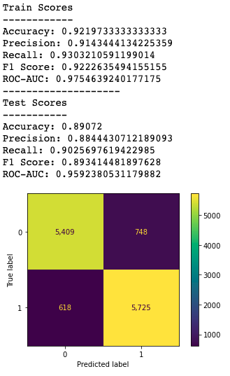
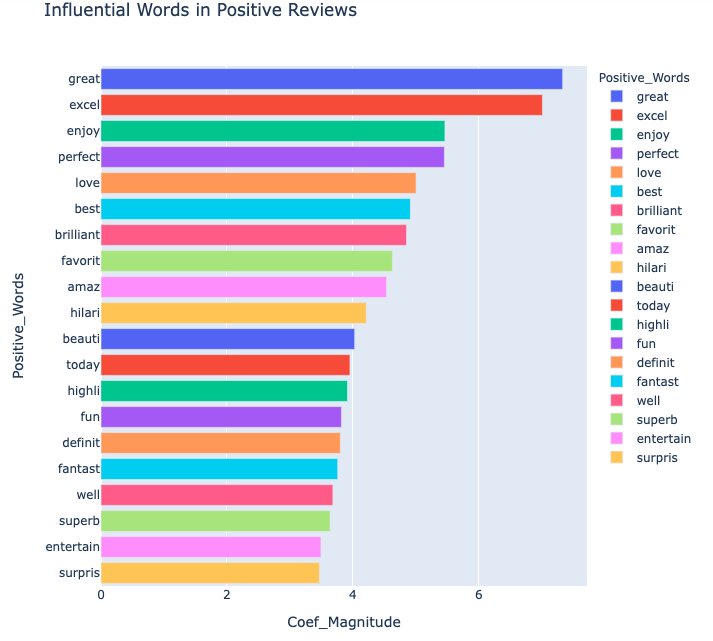
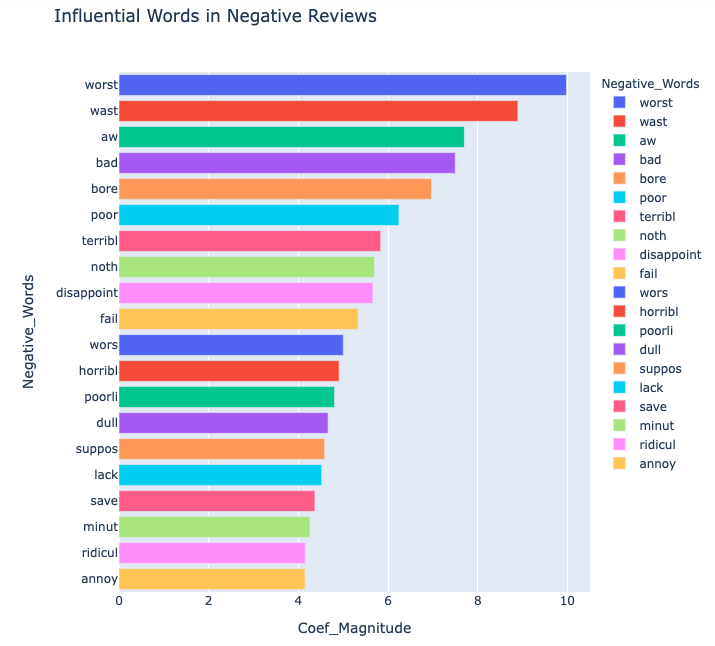

# NLPMovieReviewAnalysis

**Author**: Dan Lee

## Business Problem

Unlike most other reviewing websites which calculate the average of review scores (i.e. Amazon 4.5/5 stars, IMDB 8.2/10 rating), Rotten Tomatoes scores media on a percentage out of 100. This percentage is aggregated completely based on whether the review is positive or negative.

Rotten Tomatoes currently aggregates reviews in two ways based on:
1. Opinions of film and television critics
2. Opinions of users

Rotten Tomatoes wants to explore what the rest of the internet is saying about film and television. They want to have the ability to efficiently analyze publicly available comments/chatter (i.e. Tweets, Reddit message boards, Facebook comments) and derive a percentage score for movies and television programming.

This project will focus on just the first step of solving this business problem. Here is our proposed hypothesis:

'A model can be derived to input opinionated language material written about a film or show, so that it can reliably predict positive or negative sentiment.'

## Data Understanding

Our hypothesis will be tested on this [IMDB data set](https://www.kaggle.com/lakshmi25npathi/imdb-dataset-of-50k-movie-reviews) from kaggle. It contains 50,000 "highly polar" movie/show reviews and their positive or negative sentiment.

## Data Preparation

Mainly cleaning up the text.

## Modeling
We chose a logistic regression model using a tf-idf vectorizer

## Results

### tf-idf logistic regression


### Feature Importances




## Evaluation
Our originally stated hypothesis was:

'A model can be derived to input opinionated language material written about a film or show, so that it can reliably predict positive or negative sentiment.'

After text preprocessing and model selection, the resulting findings are:

1. We can reliably predict movie/show sentiment at a rate of 89.3%. This is significantly better than our model-less baseline of 50%.
2. We have identified an abundance of words with the most significant predictive power from our dataset of 50,000 reviews. With testing, it will be interesting to see if these feature importances are applicable to review material outside of IMDB's database.

## Repository Structure

```
├── README.md     
<- The top-level README for reviewers of this project
├── NLPMediaReviewAnalysis.ipynb   
<- Narrative documentation of analysis in Jupyter notebook
├── NLPMediaReviewAnalysis - Jupyter Notebook.pdf
<- PDF version of Jupyter notebook
├── Presentation.pdf        
<- PDF version of project presentation
├── data                                
<- Both sourced externally and generated from code
└── images                              
<- Both sourced externally and generated from code
```
≈